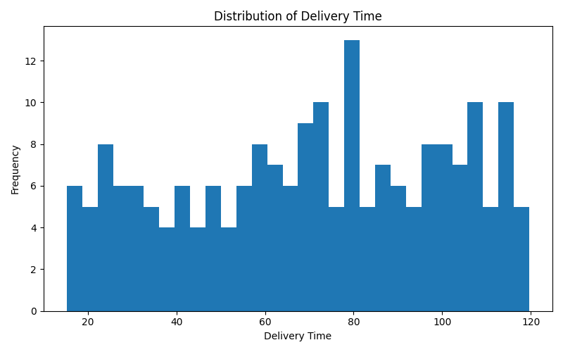

# 🍔 Food Delivery Time Prediction System

## 🧠 Food Delivery Time Prediction using Machine Learning, Predictive Analytics, and Data Science

---

## 👤 Author

**Sagnik Patra**

---

## 📌 Project Overview

This project builds an end-to-end **Food Delivery Time Prediction System** using **Machine Learning, Data Analytics, and Predictive Modeling**.

The system uses food delivery data from `Food_Delivery_Time_Prediction.csv`, performs data preprocessing, feature engineering, exploratory data analysis (EDA), distance calculation using geographical coordinates, and predictive modeling using **Linear Regression** and **Logistic Regression**.

The project predicts delivery times, classifies deliveries as **Fast** or **Delayed**, and automatically generates reports, graphs, prediction files, trained models, configuration files, and result summaries.

The system helps food delivery companies, restaurant chains, logistics providers, and researchers optimize delivery operations and improve customer satisfaction through data-driven decision-making.

---



---

## 🎯 Objectives

- Analyze food delivery operational data
- Predict delivery time using machine learning
- Classify deliveries as Fast or Delayed
- Perform exploratory data analysis (EDA)
- Calculate delivery distance using geographical coordinates
- Engineer time-based delivery features
- Train regression and classification models
- Generate prediction reports and performance summaries
- Save trained models for future deployment
- Generate graphs, heatmaps, ROC curves, and confusion matrices
- Create a complete reproducible delivery analytics pipeline

---

## 📂 Dataset Used

```text
Food_Delivery_Time_Prediction.csv
```

### Dataset Attributes

- Order_ID
- Customer_Location
- Restaurant_Location
- Distance
- Order_Time
- Weather_Conditions
- Traffic_Conditions
- Vehicle_Type
- Delivery_Person_Experience
- Restaurant_Rating
- Customer_Rating
- Order_Cost
- Delivery_Time

---

## 🔬 Feature Engineering

### Distance Calculation

The system calculates delivery distance using the **Haversine Formula** based on:

```text
Customer Latitude
Customer Longitude
Restaurant Latitude
Restaurant Longitude
```

---

### Time-Based Features

Generated features include:

```text
Order_Hour
Rush_Hour
Order_Day
Order_Month
Order_DayOfWeek
```

These features help capture delivery behavior during peak and non-peak periods.

---

## 🤖 Machine Learning Models

### Linear Regression

Used for:

- Delivery Time Prediction

Predicts the actual delivery time based on delivery-related features.

---

### Logistic Regression

Used for:

- Delivery Status Classification

Predicts whether a delivery is:

```text
Fast
Delayed
```

---

## 📊 Delivery Status Classes

The system automatically classifies deliveries into:

| Delivery Time | Category |
|--------------|-----------|
| ≤ Median Delivery Time | Fast |
| > Median Delivery Time | Delayed |

---

## 📈 Generated Outputs

### CSV Files

The project automatically generates:

```text
processed_dataset.csv
outlier_handled_dataset.csv
encoded_final_model_dataset.csv

linear_regression_predictions.csv
linear_regression_results.csv

logistic_regression_predictions.csv
logistic_regression_results.csv

correlation_matrix.csv
confusion_matrix.csv

roc_curve_data.csv

linear_feature_coefficients.csv
logistic_feature_coefficients.csv

model_comparison.csv

descriptive_statistics.csv
```

---

### Model Files

```text
linear_regression_model.pkl

logistic_regression_model.pkl
```

---

### Scaler Files

```text
linear_regression_scaler.pkl

logistic_regression_scaler.pkl
```

---

### Imputer File

```text
final_imputer.pkl
```

---

### Report Files

```text
classification_report.txt

actionable_insights.txt

final_report.md

final_report.txt

summary_results.json
```

---

## 📉 Generated Graphs

### Delivery Time Distribution

```text
delivery_time_distribution.png
```

Shows the distribution of delivery times.

---

### Correlation Heatmap

```text
correlation_heatmap.png
```

Visualizes relationships between numerical features.

---

### Actual vs Predicted Delivery Time

```text
linear_actual_vs_predicted.png
```

Compares actual and predicted delivery times.

---

### Feature Importance Graph

```text
linear_feature_coefficients.png
```

Displays the most influential features in delivery time prediction.

---

### Logistic Regression Feature Importance

```text
logistic_feature_coefficients.png
```

Shows important features for delivery status classification.

---

### Confusion Matrix Heatmap

```text
logistic_confusion_matrix.png
```

Displays classification performance.

---

### ROC Curve

```text
logistic_roc_curve.png
```

Shows classification performance across different thresholds.

---

### Boxplots

```text
boxplot_Distance.png
boxplot_Order_Cost.png
boxplot_Delivery_Time.png
...
```

Used for outlier detection and analysis.

---

## 📁 Project Structure

```text
Food Delivery Time Prediction/
│
├── Food_Delivery_Time_Prediction.csv
│
├── graphs/
│   ├── delivery_time_distribution.png
│   ├── correlation_heatmap.png
│   ├── linear_actual_vs_predicted.png
│   ├── logistic_confusion_matrix.png
│   ├── logistic_roc_curve.png
│   ├── linear_feature_coefficients.png
│   ├── logistic_feature_coefficients.png
│   └── boxplot_*.png
│
├── models/
│   ├── linear_regression_model.pkl
│   ├── logistic_regression_model.pkl
│   ├── linear_regression_scaler.pkl
│   ├── logistic_regression_scaler.pkl
│   └── final_imputer.pkl
│
├── reports/
│   ├── classification_report.txt
│   ├── actionable_insights.txt
│   ├── final_report.md
│   ├── final_report.txt
│   └── summary_results.json
│
├── results/
│   ├── processed_dataset.csv
│   ├── outlier_handled_dataset.csv
│   ├── encoded_final_model_dataset.csv
│   ├── linear_regression_predictions.csv
│   ├── logistic_regression_predictions.csv
│   ├── model_comparison.csv
│   └── descriptive_statistics.csv
│
└── README.md
```

---

## ⚙️ Installation

Install required libraries:

```bash
pip install pandas numpy matplotlib seaborn scikit-learn joblib
```

---

## ▶️ Run Project

```bash
python food_delivery_time_prediction.py
```

---

## 📊 Evaluation Metrics

### Regression Metrics

- Mean Absolute Error (MAE)
- Mean Squared Error (MSE)
- Root Mean Squared Error (RMSE)
- R² Score

### Classification Metrics

- Accuracy
- Precision
- Recall
- F1 Score
- Confusion Matrix
- ROC Curve
- AUC Score

---

## 💡 Actionable Insights

### Route Optimization

- Optimize delivery routes using traffic and distance information.

### Peak Hour Staffing

- Increase delivery personnel during rush-hour periods.

### Weather-Based Planning

- Adjust estimated delivery times during poor weather conditions.

### Driver Allocation

- Assign experienced delivery personnel to high-priority orders.

### Customer Communication

- Notify customers early when delays are predicted.

### Vehicle Optimization

- Choose vehicle types based on traffic density and route distance.

### Operational Efficiency

- Improve delivery performance through data-driven decision-making.

---

## 🎯 Applications

- Food Delivery Platforms
- Restaurant Chains
- Logistics Optimization
- Last-Mile Delivery Analytics
- Supply Chain Management
- Delivery Route Planning
- Customer Experience Optimization
- Delivery Workforce Planning
- Smart City Logistics Research

---

## 🔮 Future Enhancements

- Random Forest Regression
- XGBoost Models
- Deep Learning Models (LSTM, GRU)
- Real-Time Delivery Tracking
- GPS Route Optimization
- Explainable AI (SHAP)
- Delivery Demand Forecasting
- Cloud Deployment
- Delivery Recommendation Engine
- Real-Time Dashboard using Streamlit

---

## 📜 License

This project is developed for educational, research, and academic purposes.

---

## ⭐ Project Highlights

✅ Food Delivery Time Prediction

✅ Delivery Status Classification

✅ Linear Regression Model

✅ Logistic Regression Model

✅ Distance Calculation using Haversine Formula

✅ Feature Engineering

✅ Exploratory Data Analysis

✅ Correlation Heatmaps

✅ Confusion Matrix Visualization

✅ ROC Curve Analysis

✅ Prediction Reports

✅ JSON Summaries

✅ Model Persistence

✅ Automated Reporting

✅ Reproducible Delivery Analytics Pipeline

---
